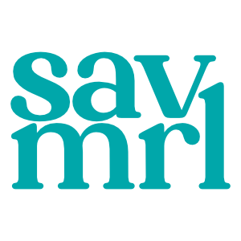
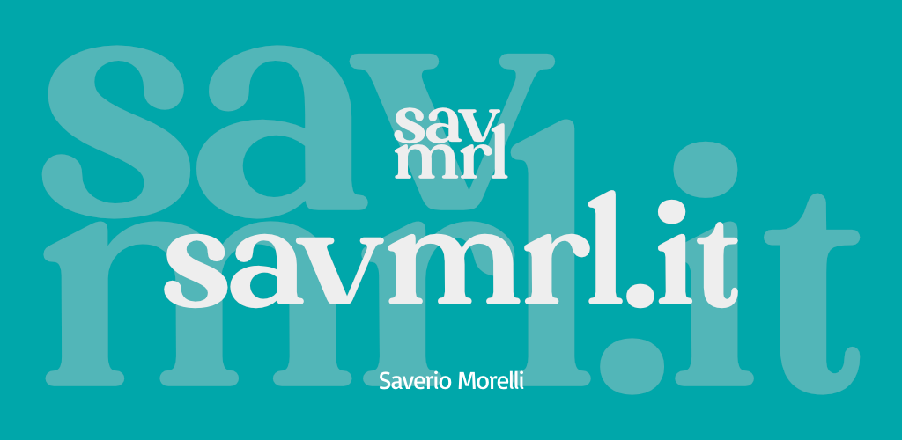

<h1 align="center">
     
    
     
    savmrl.it
     
</h1>

This is the official repo for the https://savmrl.it project.

### What savmrl.it is

savmrl.it is an anonymous and free shortener and redirect service. It permits to get shorter links and also to track how many times your links have been opened.

You can use this service without any registration, just go to http://savmrl.it and start to use it!

### Web browser add-on

It's available also an official add-on of this project, see repo: https://github.com/Sav22999/savmrl.it-addon

### Support me and my work

If you like this project, leave a *Star* ⭐ to receive updates on your *GitHub dashboard*.

To support me, you can do a donation :smile: with **LiberaPay** or **PayPal**:

 [</img>](https://paypal.me/saveriomorelli)

### Screenshots

</img>

 
